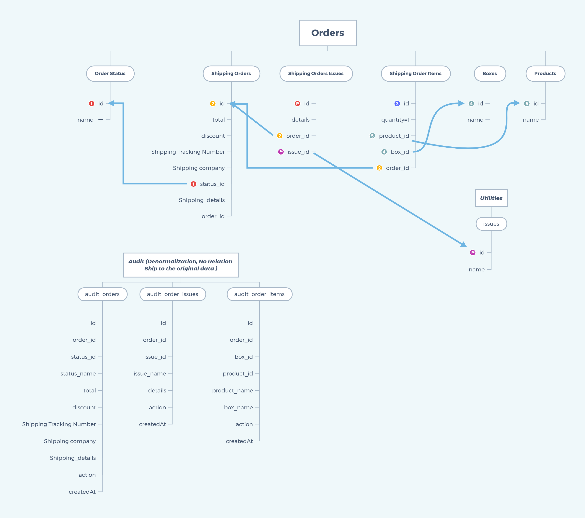

## 1) Environment Setup (Symfony 5.4) - PHP 7.4

Install the dependencies
```sh
composer update
```

Create Database & Initial data
```sh
php bin/console doctrine:database:create
php bin/console make:migration
php bin/console doctrine:migrations:migrate
php bin/console doctrine:fixtures:load
```
To Run Tests

```sh
php ./vendor/bin/phpunit
```
---
## 2) Postman Collection
https://www.getpostman.com/collections/2f21c16a6a49c484e2dd


## 3) Component Used In This Assessment 
```sh
Rate Limiter
Event Subscribers
Serializer (Custom Encoder/Decoder, Custom Normalizer/Deserializer)
Cache
```
----
## 4)  DB Design
